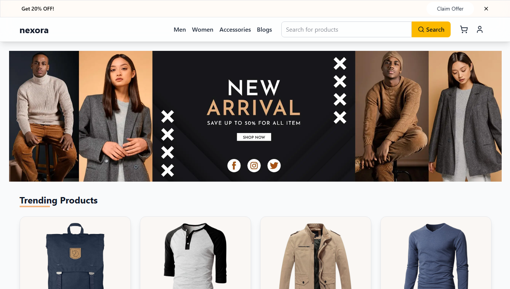
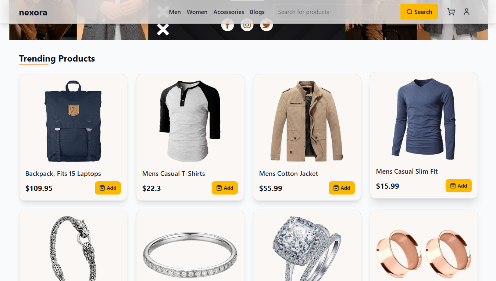
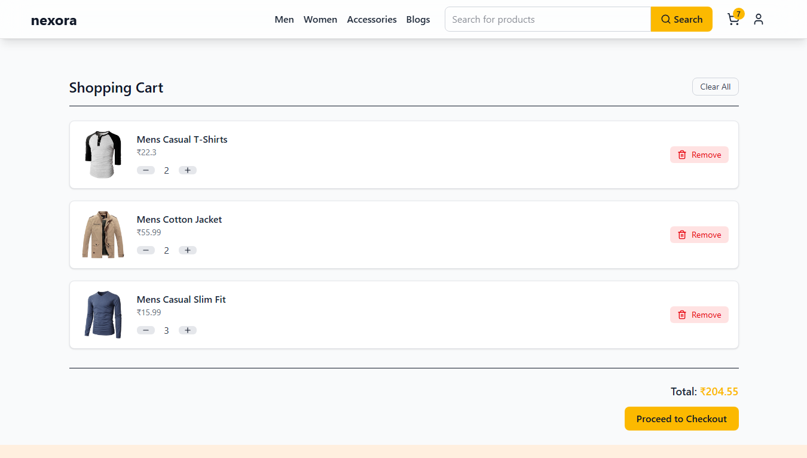
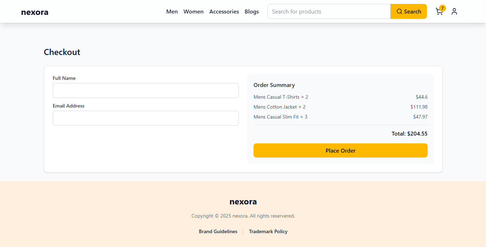
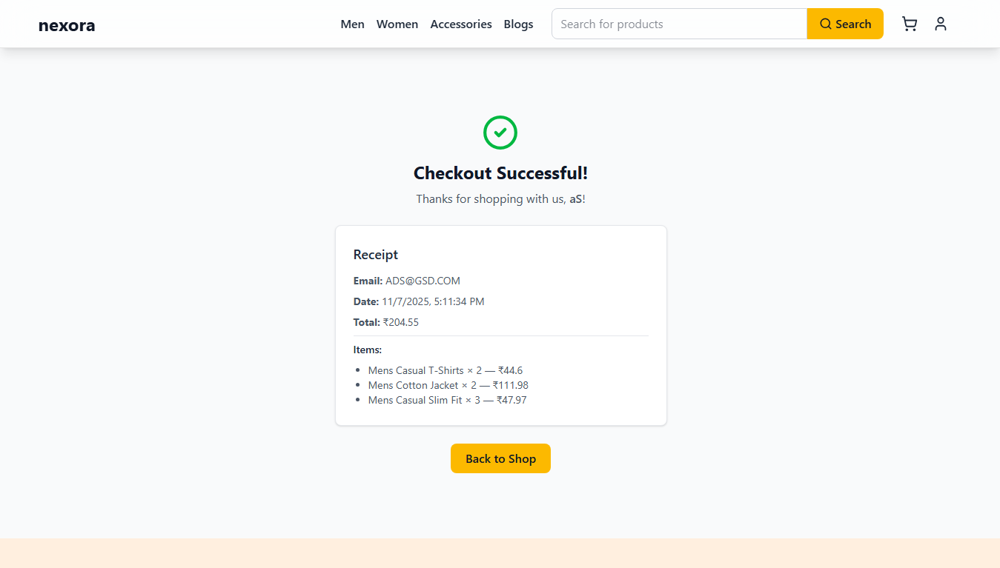

# Nexora Full Stack Internship Assignment

A complete mock e-commerce cart system built for the **Nexora Full Stack Internship assignment**.
Implements **product listing**, **cart management**, **checkout**, and **mock receipt generation** — all in a clean Nexora-style UI.

## Demo Video

[Watch the walkthrough video on Loom](https://www.loom.com/share/848073f40b3b4b7fb16d2a720ff77492)

## 📸 Screenshots

| Feature                      | Preview                                      |
| ---------------------------- | -------------------------------------------- |
| **Home Page**                |         |
| **Home Page (Product Grid)** |   |
| **Cart Page**                |          |
| **Checkout Form**            |  |
| **Receipt Page**             |    |

## Tech Stack

### Frontend

- React + Vite
- Tailwind CSS
- Zustand (state management)
- TanStack Query + Axios (data fetching)
- React Hot Toast
- Lucide React (icons)

### Backend

- Node.js + Express
- MongoDB + Mongoose
- FakeStore API (for initial data seeding)

## Project Folder Structure

```

nexora-assignment/
│
├── backend/
│   ├── server.js
│   ├── routes/
│   │   ├── productRoutes.js
│   │   └── cartRoutes.js
│   ├── controllers/
│   │   ├── productController.js
│   │   └── cartController.js
│   ├── models/
│   │   └── Product.js
│   ├── seed/
│   │   └── seedProducts.js
│   ├── .env.example
│   └── package.json
│
├── frontend/
│   ├── src/
│   │   ├── pages/
│   │   │   ├── ProductGrid.jsx
│   │   │   ├── Cart.jsx
│   │   │   ├── Checkout.jsx
│   │   │   └── Receipt.jsx
│   │   ├── store/
│   │   │   ├── useCartStore.js
│   │   │   └── useProductStore.js
│   │   ├── components/
│   │   │   └── Navbar.jsx
│   │   ├── App.jsx
│   │   └── main.jsx
│   ├── tailwind.config.js
│   ├── vite.config.js
│   └── package.json
│
└── README.md
└── Screenshots

```

## Setup Instructions

### Clone the repository

```bash
git clone https://github.com/Prajwal-BLR-IN/nexora-assignment.git
cd nexora-assignment
```

### Setup and run the backend

```bash
cd backend
npm install
```

#### Create a `.env` file in `/backend`

Create a new file named `.env` inside the **backend** folder and **add your own MongoDB connection URL** along with the server port:

```env
MONGODB_URL=<your-own-mongodb-connection-url>
PORT=5000
```

> Replace `<your-own-mongodb-connection-url>` with your actual MongoDB Atlas or local MongoDB URL before starting the backend.

#### Seed database (Run **ONCE**)

Use the **FakeStore API** to populate your MongoDB with sample products just run below command in terminal to seed:

```bash
node seed/seedProducts.js
```

**Important:** Run this **only once** to avoid duplicate products in your DB.

#### Start the backend server

```bash
npm start
```

### Setup and run the frontend

```bash
cd ../frontend
npm install
npm run dev
```

Frontend will start on **[http://localhost:5173](http://localhost:5173)** (by default).

## API Endpoints

| Method     | Endpoint        | Description                          |
| ---------- | --------------- | ------------------------------------ |
| **GET**    | `/api/products` | Fetch all products                   |
| **POST**   | `/api/cart`     | Add item to cart                     |
| **GET**    | `/api/cart`     | Get all cart items                   |
| **DELETE** | `/api/cart/:id` | Remove cart item                     |
| **POST**   | `/api/checkout` | Mock checkout → returns receipt data |

## Flow Overview

1. Products fetched from backend (`/api/products`)
2. User adds items to cart
3. Cart data managed globally via Zustand
4. Checkout collects user info
5. Mock receipt generated (total + timestamp)
6. Data reset after checkout

## Features Implemented

- Product listing with dynamic filtering (search bar)
- Add / remove from cart
- Quantity control (+ / −)
- Real-time total calculation
- Mock checkout form
- Mock receipt page (no real payments)
- Fully responsive Nexora-themed UI

## Developer Info

**Author:** Prajwal K  
**Project:** Nexora Full Stack Internship Assignment  
**Contact:** [https://www.linkedin.com/in/prajwal-k-b26344173/]

“Built as a vibe-based e-commerce experience for Nexora, using clean code and a modern stack.”
